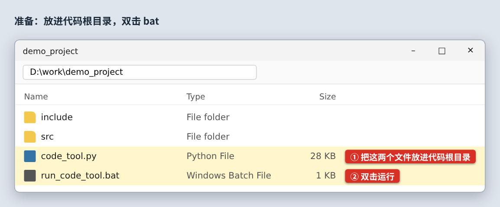
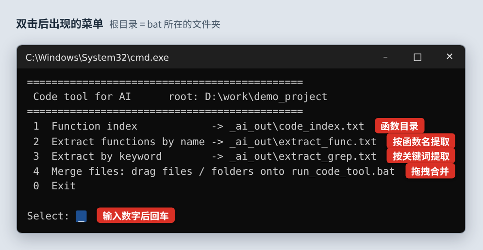
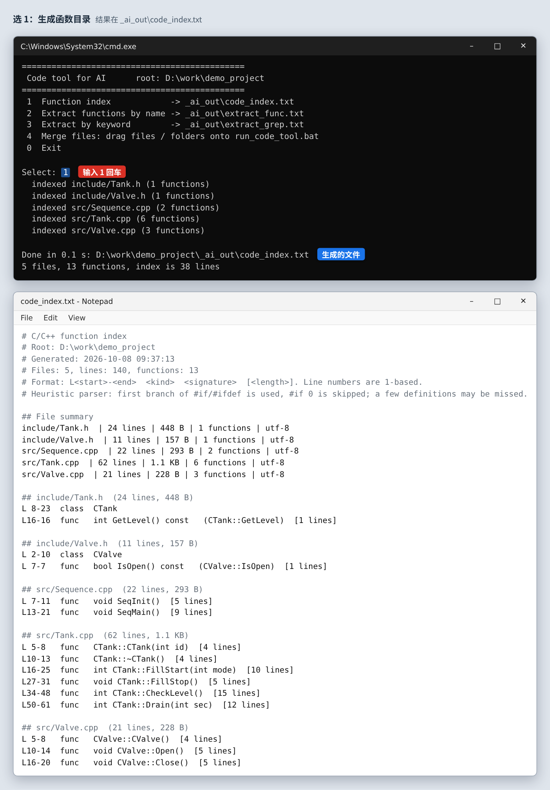
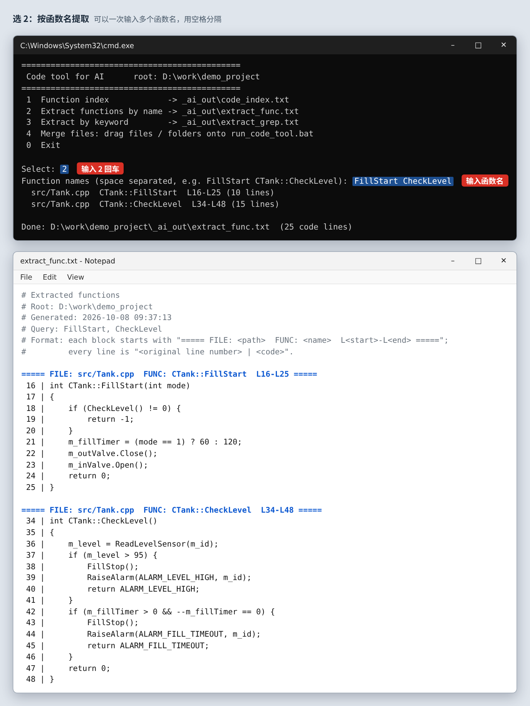
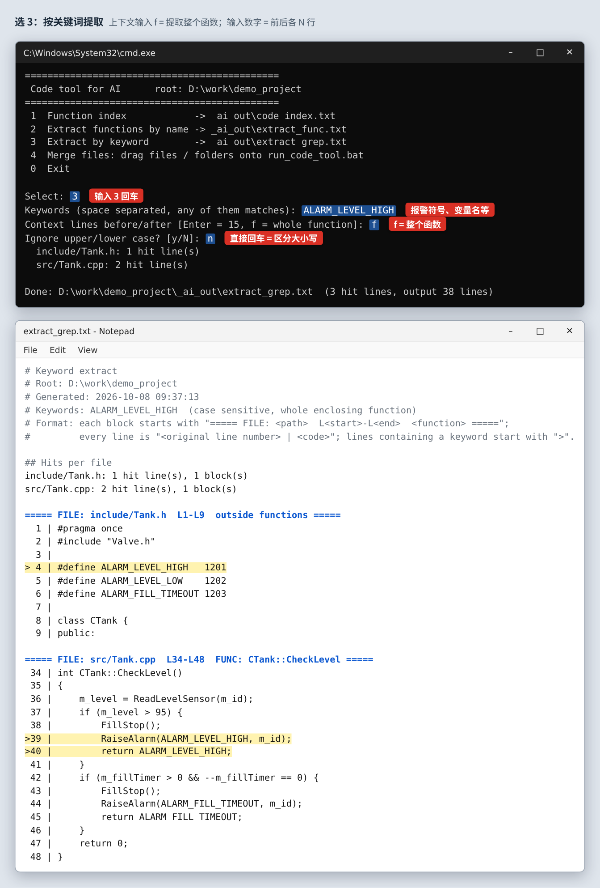
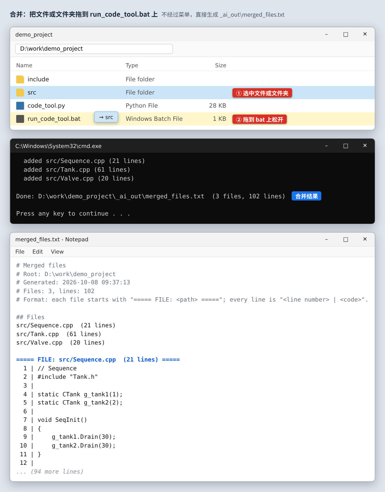

# 代码提取工具（大代码喂给 AI 用）

9 万行、几 MB 的 `.cpp` 不可能整个交给 Copilot 读。这个工具反过来做：**先给 AI 一份函数目录，再只提取它需要的几个函数或几段代码**，每次拖给 AI 的都是一个小 txt。

只用 Python 标准库，不用 pip 安装任何东西。

> 下面的图用一个示例小项目 `demo_project` 演示。图里的命令行输出和 txt 内容都是工具实际运行的结果，按 Windows 窗口的样子画出来（不是在 Windows 上截的屏）。

---

## 0. 准备：放进代码根目录，双击 bat

把 `code_tool.py` 和 `run_code_tool.bat` 放进代码的根目录（和 `目录结构扫描` 的两个文件放在一起也可以），然后双击 `run_code_tool.bat`。

结果都输出到根目录下新建的 `_ai_out\` 文件夹，不会改动源代码。

## 1. 菜单

双击后出现这个菜单，输入数字后回车。做完一项会回到菜单，可以接着做下一项；输入 `0` 退出。

## 2. 选 1：生成函数目录

扫描所有 C/C++ 文件，列出每个类和函数的**行号范围**。9 万行的文件，目录也只有一两千行，AI 能完整读完。

## 3. 选 2：按函数名提取

输入一个或多个函数名（空格分隔），提取这些函数的完整代码。只写函数名（`CheckLevel`）或带类名（`CTank::CheckLevel`）都可以。

## 4. 选 3：按关键词提取

查报警、变量、地址符号时用。输入关键词后：

- 上下文输入 **`f`**：提取包含关键词的**整个函数**
- 输入数字，比如 `20`：提取命中行的前后各 20 行
- 直接回车：前后各 15 行

命中的行前面有 `>`，每段上方标着文件、行号和所在函数。

## 5. 拖拽合并

把文件或文件夹**直接拖到 `run_code_tool.bat` 上**，不经过菜单，合并成一个 `merged_files.txt`。适合小文件，一次只占 Copilot 一个上传名额。

---

## 推荐流程（配合 Copilot）

1. 选 1，生成 `code_index.txt`，和 `file_structure.txt` 一起拖给 Copilot，说明要查的问题，让它列出需要看的函数名
2. 选 2，输入这些函数名，把 `extract_func.txt` 拖给 Copilot
3. 查报警或变量时选 3，输入报警符号，上下文填 `f`，得到所有用到它的函数

## 注意

- 函数识别是按代码格式推断的，没有用编译器：`#if/#ifdef ... #else` 只按第一个分支解析，`#if 0` 跳过。宏写得特殊的地方可能漏掉个别函数；某个文件括号对不上时，目录里会标 `!` 提醒。
- 关键词默认区分大小写，菜单里可以选择忽略大小写。
- 编码自动判断（UTF-8 / Shift-JIS），输出统一为 UTF-8，记事本打开不乱码。
- 输出超过 3000 行时会提示：AI 可能读不完，请换更具体的关键词或减少上下文行数。
- 每次运行会覆盖 `_ai_out\` 里同名的旧文件，需要保留的话先改名。
- 也可以用命令行：`py code_tool.py grep ALARM_LEVEL_HIGH -f`，`py code_tool.py func FillStart CheckLevel`。
